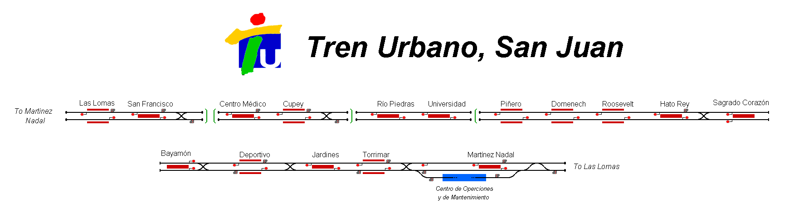

# Railway Operation Simulator Template Map

A representation of the _Tren Urbano_ transit system operating within the Puerto Rican capital of San Juan.

## Current Status

| Stage         | Status        |
| ------------- |:-------------:|
| Track Plan     | :heavy_check_mark: |
| Signalling      | :heavy_check_mark:      |
| Naming | :heavy_check_mark:      |
| Speed Limits | :heavy_check_mark: |
| Distances | :heavy_check_mark: |
| Timetable | :heavy_check_mark: |
| Documentation | :x: |

## Data Sources

- A List of links pointing to various sources
- For example:
- [Carto Metro Paris Metro Map](http://carto.metro.free.fr/cartes/metro-paris/)
